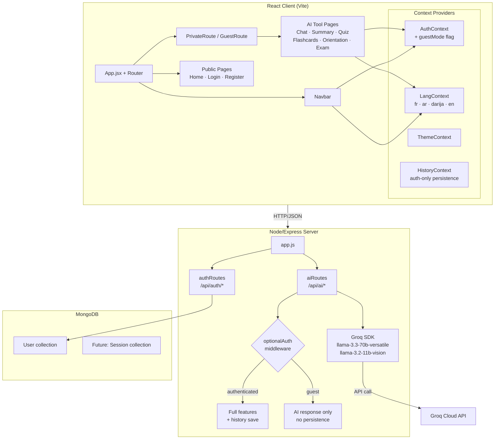
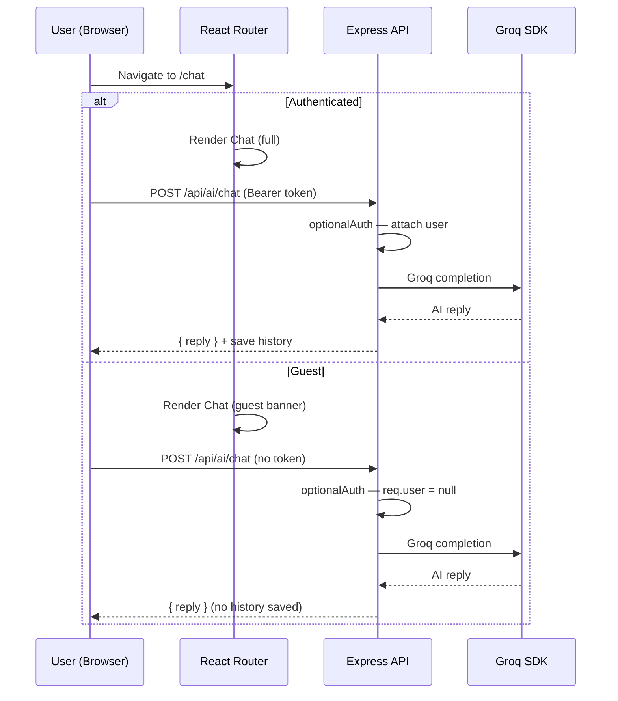
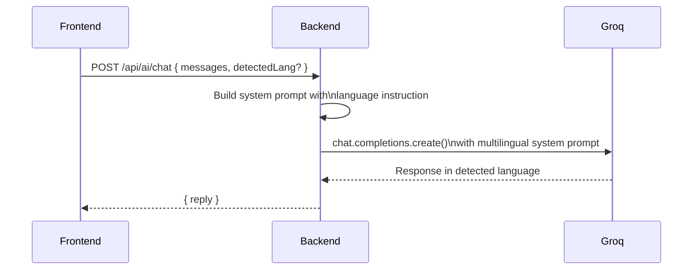

# Design Document: EduCompass AI Enhancement


## Overview

EduCompass is an AI-powered study assistant for Moroccan students (lycée and university level). The current system provides six AI-driven tools — Chat, Summary, Quiz, Flashcards, Orientation, and Exam — all gated behind authentication, with a French/Arabic language switcher and a beige/brown visual theme.

This enhancement covers seven interconnected areas: (1) improving AI prompt quality and response efficiency across all six tools; (2) visual/UI polish while preserving the existing color palette; (3) automatic multilingual AI responses in French, Darija, Arabic (MSA), and English; (4) replacing all inline emoji icons with a proper icon library (react-icons/Bootstrap Icons); (5) introducing a guest mode that allows unauthenticated access to all AI tools with ephemeral (non-persisted) sessions; (6) expanding the language switcher from FR/AR to FR/AR/Darija/EN; and (7) adding contextual illustrations and images to improve visual appeal in the hero section, feature cards, and empty states.

The changes span both the React frontend (contexts, routing, components, pages, styles) and the Node/Express backend (AI route prompts, optional auth middleware). The existing beige/brown design system, Groq SDK integration, MongoDB/JWT auth stack, and Context API architecture are all preserved and extended rather than replaced.


## Architecture

### High-Level System Architecture



### Request Flow — Guest vs Authenticated



### Language Detection Flow (AI Side)




## Components and Interfaces

### Component 1: AuthContext (enhanced)

**Purpose**: Manages authentication state and introduces a `guestMode` flag so unauthenticated users can access AI tools without being redirected to `/login`.

**Interface**:
```typescript
interface AuthContextValue {
  user: User | null          // null when logged out or guest
  guestMode: boolean         // true when user explicitly chose "continue as guest"
  loading: boolean
  login: (userData: User, token: string) => void
  logout: () => void
  enterGuestMode: () => void // sets guestMode = true, user stays null
  exitGuestMode: () => void  // clears guestMode flag
}

interface User {
  id: string
  name: string
  email: string
}
```

**Responsibilities**:
- Persist authenticated user in `localStorage` (existing behavior)
- Expose `guestMode` boolean derived from `sessionStorage` (ephemeral, cleared on tab close)
- `enterGuestMode()` writes a flag to `sessionStorage` so guest state survives page refresh within the same tab but not across tabs/sessions

---

### Component 2: LangContext (enhanced)

**Purpose**: Extends the existing FR/AR switcher to support four locales: `fr`, `ar`, `darija`, `en`. Provides RTL flag for Arabic and Darija.

**Interface**:
```typescript
type Locale = 'fr' | 'ar' | 'darija' | 'en'

interface LangContextValue {
  lang: Locale
  setLang: (locale: Locale) => void
  t: TranslationMap       // full translation object for current locale
  isRTL: boolean          // true for 'ar' and 'darija'
}

interface TranslationMap {
  // All existing keys preserved, new keys added for Darija/EN
  [key: string]: string
}
```

**Responsibilities**:
- Maintain translation maps for all four locales
- Persist selected language in `localStorage` so it survives page refresh
- Set `dir="rtl"` wrapper for `ar` and `darija` locales
- Darija uses Arabic script (RTL) with Moroccan colloquial vocabulary

---

### Component 3: Navbar (enhanced)

**Purpose**: Top navigation bar with logo, four-language switcher, theme toggle, and auth-aware links.

**Interface**:
```typescript
// No props — reads from AuthContext, LangContext, ThemeContext
function Navbar(): JSX.Element
```

**Responsibilities**:
- Display `educompass_logo.svg` as the brand logo (replacing the 🎓 emoji placeholder)
- Show four language buttons: FR · عر · دارجة · EN
- Show "Continue as Guest" option on the login/register links area when user is not authenticated
- Replace emoji icons (👤, 🌙, ☀️) with react-icons equivalents
- Highlight active language button

---

### Component 4: GuestBanner

**Purpose**: A dismissible informational strip shown at the top of AI tool pages when the user is in guest mode, prompting them to log in to save their work.

**Interface**:
```typescript
interface GuestBannerProps {
  onLogin: () => void      // navigate to /login
  onRegister: () => void   // navigate to /register
  onDismiss: () => void    // hide banner for this session
}
```

**Responsibilities**:
- Render a non-blocking banner (not a modal) below the Navbar
- Show translated message in current language
- Provide Login and Register CTA buttons
- Dismissible per-session (sessionStorage flag)

---

### Component 5: AI Tool Pages (Chat, Summary, Quiz, Flashcards, Orientation, Exam)

**Purpose**: Each page is enhanced with icon replacements, guest-mode awareness, and improved AI prompts via the backend.

**Shared interface changes**:
```typescript
// All tool pages now accept guest mode gracefully:
// - No redirect to /login
// - History is NOT saved when guestMode === true
// - GuestBanner is shown
// - All AI features work identically
```

**Responsibilities per page**:
- Replace all emoji icons with react-icons components
- Pass `detectedLang` hint to API calls where applicable
- Show empty-state illustrations when no result is available
- Chat: show login prompt after N messages in guest mode (soft nudge, not a block)

---

### Component 6: optionalAuth Middleware (backend)

**Purpose**: Replaces the hard `requireAuth` middleware on AI routes. Allows both authenticated and unauthenticated requests; attaches `req.user` when a valid token is present.

**Interface**:
```javascript
// middleware/optionalAuth.js
function optionalAuth(req, res, next): void
// Sets req.user = decoded JWT payload if valid token present
// Sets req.user = null if no token or invalid token
// Always calls next() — never returns 401
```

**Responsibilities**:
- Attempt to verify `Authorization: Bearer <token>` header
- On success: attach `req.user`, call `next()`
- On failure/absence: set `req.user = null`, call `next()`
- AI route handlers check `req.user` to decide whether to persist history


## Data Models

### Model 1: AuthState (client)

```typescript
interface AuthState {
  user: {
    id: string
    name: string
    email: string
  } | null
  guestMode: boolean   // stored in sessionStorage as 'educompass_guest'
  loading: boolean
}
```

**Validation Rules**:
- `user` and `guestMode` are mutually exclusive: if `user !== null`, `guestMode` must be `false`
- `guestMode` is ephemeral — stored in `sessionStorage`, not `localStorage`
- Token stored separately in `localStorage` as `student_ai_token`

---

### Model 2: LangState (client)

```typescript
type Locale = 'fr' | 'ar' | 'darija' | 'en'

interface LangState {
  lang: Locale                    // persisted in localStorage as 'educompass_lang'
  isRTL: boolean                  // computed: lang === 'ar' || lang === 'darija'
}
```

**Validation Rules**:
- `lang` must be one of the four valid locale codes
- `isRTL` is always derived, never stored independently

---

### Model 3: HistoryEntry (client — existing, unchanged)

```typescript
interface HistoryEntry {
  id: number           // Date.now()
  type: 'chat' | 'summary' | 'quiz' | 'orientation' | 'flashcard' | 'exam'
  title: string        // first 60 chars of input
  date: string         // ISO 8601
}
```

**Validation Rules**:
- History is only written when `AuthContext.user !== null` (authenticated users only)
- Guest sessions produce no history entries
- Max 50 entries retained (existing behavior)

---

### Model 4: AI Request/Response (backend)

```typescript
// Chat
interface ChatRequest  { messages: { role: 'user' | 'assistant', content: string }[] }
interface ChatResponse { reply: string }

// Summary
interface SummaryRequest  { text: string }
interface SummaryResponse { summary: string }

// Quiz
interface QuizRequest  { courseText?: string; subject?: string; numQ?: number }
interface QuizResponse { questions: QuizQuestion[] }
interface QuizQuestion { question: string; options: string[]; correct: number }

// Flashcards
interface FlashcardsRequest  { text: string }
interface FlashcardsResponse { cards: Flashcard[] }
interface Flashcard          { question: string; answer: string }

// Orientation
interface OrientationRequest  { text: string }
interface OrientationResponse { advice: string }

// Exam (uses quiz endpoint internally)
interface ExamRequest  { subject: string; numQ: number; duration: number }
interface ExamResponse { questions: QuizQuestion[] }
```


## Algorithmic Pseudocode

### Algorithm 1: Guest Mode Access Control

```pascal
ALGORITHM resolveRouteAccess(path, authState)
INPUT:  path      — requested URL path
        authState — { user, guestMode }
OUTPUT: renderDecision — RENDER_PAGE | REDIRECT_LOGIN | RENDER_WITH_GUEST_BANNER

BEGIN
  isAIToolPath ← path IN ['/chat', '/summary', '/quiz',
                           '/orientation', '/flashcards', '/exam']
  isPrivatePath ← path IN ['/dashboard', '/profile']

  IF authState.user IS NOT NULL THEN
    RETURN RENDER_PAGE   // authenticated — full access, no banner

  ELSE IF isPrivatePath THEN
    RETURN REDIRECT_LOGIN  // dashboard/profile always require auth

  ELSE IF isAIToolPath AND authState.guestMode = true THEN
    RETURN RENDER_WITH_GUEST_BANNER  // guest can use AI tools

  ELSE IF isAIToolPath AND authState.guestMode = false THEN
    // First visit to an AI tool while logged out:
    // Show the page but prompt guest mode entry
    RETURN RENDER_WITH_GUEST_BANNER

  ELSE
    RETURN RENDER_PAGE  // public pages (Home, Login, Register)
  END IF
END
```

**Preconditions**:
- `authState` is fully initialized (loading = false)
- `path` is a valid application route

**Postconditions**:
- Authenticated users always get `RENDER_PAGE`
- `/dashboard` and `/profile` always redirect unauthenticated users
- AI tool pages are accessible to guests with a banner

---

### Algorithm 2: Language Auto-Detection for AI Responses

```pascal
ALGORITHM buildMultilingualSystemPrompt(basePrompt, uiLang)
INPUT:  basePrompt — the tool-specific system instruction
        uiLang     — current UI locale ('fr' | 'ar' | 'darija' | 'en')
OUTPUT: enrichedPrompt — system prompt with language instruction prepended

BEGIN
  langInstruction ← MAP uiLang TO:
    'fr'     → "Réponds TOUJOURS dans la langue de l'étudiant.
                Si le message est en français → réponds en français.
                Si en arabe classique → réponds en arabe.
                Si en darija (arabe marocain) → réponds en darija.
                Si en anglais → réponds en anglais."
    'ar'     → "أجب دائماً بلغة الطالب.
                إذا كانت الرسالة بالعربية → أجب بالعربية.
                إذا بالفرنسية → أجب بالفرنسية.
                إذا بالدارجة → أجب بالدارجة.
                إذا بالإنجليزية → أجب بالإنجليزية."
    'darija' → "Jaweb dima b-logha dyal l-étudiant.
                Ila l-message b-darija → jaweb b-darija.
                Ila b-français → jaweb b-français.
                Ila b-3arabiya → jaweb b-3arabiya.
                Ila b-ingliziya → jaweb b-ingliziya."
    'en'     → "Always respond in the student's language.
                If the message is in English → respond in English.
                If in French → respond in French.
                If in Darija → respond in Darija.
                If in Arabic → respond in Arabic."
  END MAP

  enrichedPrompt ← langInstruction + "\n\n" + basePrompt

  RETURN enrichedPrompt
END
```

**Preconditions**:
- `uiLang` is one of the four valid locale codes
- `basePrompt` is a non-empty string

**Postconditions**:
- Returned prompt always begins with the language instruction
- The AI model will mirror the student's input language regardless of UI locale

---

### Algorithm 3: Icon Replacement Mapping

```pascal
ALGORITHM resolveIcon(emojiOrContext, library)
INPUT:  emojiOrContext — original emoji character or semantic context string
        library        — 'react-icons/bs' (Bootstrap Icons via react-icons)
OUTPUT: IconComponent  — the react-icons component to render

BEGIN
  iconMap ← {
    '💬'          → BsChatDots,
    '📝'          → BsFileEarmarkText,
    '🧠'          → BsBrainFill,        // or BsLightbulb
    '🧭'          → BsCompass,
    '🃏'          → BsCardText,
    '⏱️'          → BsStopwatch,
    '🤖'          → BsRobot,
    '👤'          → BsPersonCircle,
    '🎓'          → BsMortarboard,      // navbar brand
    '🌙'          → BsMoon,
    '☀️'          → BsSun,
    '📎'          → BsPaperclip,
    '📄'          → BsFileEarmark,
    '⏳'          → BsHourglass,
    '➤'           → BsSend,
    '❌'          → BsXCircle,
    '🏆'          → BsTrophy,
    '👍'          → BsHandThumbsUp,
    '📚'          → BsBook,
    '👋'          → BsHandWave,
    '📌'          → BsPinAngle,
  }

  IF emojiOrContext IN iconMap THEN
    RETURN iconMap[emojiOrContext]
  ELSE
    RETURN BsQuestionCircle  // fallback
  END IF
END
```

**Preconditions**:
- `library` package (`react-icons`) is installed in the client
- All referenced icon names exist in the `react-icons/bs` namespace

**Postconditions**:
- Every emoji in the codebase has a deterministic icon replacement
- No emoji characters remain in JSX after migration

---

### Algorithm 4: AI Prompt Enhancement (per tool)

```pascal
ALGORITHM buildOptimizedPrompt(tool, input, uiLang)
INPUT:  tool   — 'chat' | 'summary' | 'quiz' | 'flashcards' | 'orientation' | 'exam'
        input  — user-provided text or message array
        uiLang — current UI locale
OUTPUT: { systemPrompt, userMessage, maxTokens }

BEGIN
  langPrefix ← buildMultilingualSystemPrompt("", uiLang)

  basePrompts ← MAP tool TO:
    'chat' →
      system: "Tu es un assistant pédagogique expert pour étudiants marocains
               (lycée et université). Tu aides avec révisions, explications,
               méthodes de travail et orientation. Sois encourageant, précis
               et pédagogique. Utilise des exemples concrets du contexte marocain.
               Limite tes réponses à 400 mots maximum."
      maxTokens: 1000

    'summary' →
      system: "Tu es un expert en synthèse pédagogique. Crée des résumés
               structurés avec : idées principales, concepts clés, et résumé
               concis. Utilise du markdown pour la mise en forme.
               Adapte la longueur au contenu fourni."
      maxTokens: 1500

    'quiz' →
      system: "Génère exactement {numQ} questions QCM de qualité pour étudiants
               marocains. Chaque question doit avoir 4 options claires et une
               seule bonne réponse. Varie les niveaux de difficulté.
               Réponds UNIQUEMENT en JSON valide :
               [{\"question\":\"...\",\"options\":[\"A\",\"B\",\"C\",\"D\"],\"correct\":0}]"
      maxTokens: 2500

    'flashcards' →
      system: "Génère exactement 8 flashcards question/réponse à partir du cours.
               Questions claires et concises. Réponses complètes mais brèves.
               Couvre les concepts les plus importants.
               Réponds UNIQUEMENT en JSON valide :
               [{\"question\":\"...\",\"answer\":\"...\"}]"
      maxTokens: 1800

    'orientation' →
      system: "Tu es conseiller d'orientation expert pour le système éducatif
               marocain (lycée, CPGE, universités, grandes écoles). Analyse le
               profil de l'étudiant et fournis des recommandations concrètes :
               filières, établissements au Maroc, matières à renforcer,
               débouchés professionnels."
      maxTokens: 1500

    'exam' →
      system: "Génère exactement {numQ} questions d'examen de niveau {level}
               sur la matière {subject}. Questions variées (définition, application,
               analyse). Réponds UNIQUEMENT en JSON valide :
               [{\"question\":\"...\",\"options\":[\"A\",\"B\",\"C\",\"D\"],\"correct\":0}]"
      maxTokens: 3000
  END MAP

  selected ← basePrompts[tool]
  enrichedSystem ← langPrefix + "\n\n" + selected.system

  RETURN {
    systemPrompt: enrichedSystem,
    userMessage:  input,
    maxTokens:    selected.maxTokens
  }
END
```

**Preconditions**:
- `tool` is one of the six valid tool identifiers
- `input` is non-empty

**Postconditions**:
- Every returned prompt includes the multilingual language instruction
- `maxTokens` is calibrated per tool to balance quality and latency
- JSON-output tools (quiz, flashcards) include strict format instructions

**Loop Invariants**: N/A (no loops in this algorithm)


## Key Functions with Formal Specifications

### Function 1: `enterGuestMode()` — AuthContext

```typescript
function enterGuestMode(): void
```

**Preconditions**:
- `user === null` (cannot enter guest mode while authenticated)
- `sessionStorage` is available

**Postconditions**:
- `guestMode === true`
- `sessionStorage.getItem('educompass_guest') === 'true'`
- `user` remains `null`
- No network request is made

**Loop Invariants**: N/A

---

### Function 2: `setLang(locale)` — LangContext

```typescript
function setLang(locale: Locale): void
```

**Preconditions**:
- `locale` is one of `'fr' | 'ar' | 'darija' | 'en'`

**Postconditions**:
- `lang === locale`
- `isRTL === (locale === 'ar' || locale === 'darija')`
- `localStorage.getItem('educompass_lang') === locale`
- The root `<div>` `dir` attribute is updated to `'rtl'` or `'ltr'` accordingly

**Loop Invariants**: N/A

---

### Function 3: `optionalAuth(req, res, next)` — Express middleware

```typescript
function optionalAuth(req: Request, res: Response, next: NextFunction): void
```

**Preconditions**:
- `req.headers.authorization` may or may not be present
- `process.env.JWT_SECRET` is defined

**Postconditions**:
- If a valid `Bearer <token>` is present: `req.user` is set to the decoded JWT payload
- If no token or invalid token: `req.user === null`
- `next()` is always called — this middleware never sends a response
- No `401` or `403` response is ever sent by this middleware

**Loop Invariants**: N/A

---

### Function 4: `buildMultilingualSystemPrompt(basePrompt, uiLang)` — aiRoutes.js

```typescript
function buildMultilingualSystemPrompt(basePrompt: string, uiLang: string): string
```

**Preconditions**:
- `basePrompt` is a non-empty string
- `uiLang` is one of `'fr' | 'ar' | 'darija' | 'en'`; defaults to `'fr'` if unrecognized

**Postconditions**:
- Returns a string that starts with the language detection instruction
- The language instruction is in the same language as `uiLang` (French instruction for FR, Arabic for AR, etc.)
- `basePrompt` content is fully preserved in the output
- `result.length > basePrompt.length` always

**Loop Invariants**: N/A

---

### Function 5: `safeParseJSON(text, fallback)` — aiRoutes.js (existing, unchanged)

```typescript
function safeParseJSON<T>(text: string, fallback: T): T
```

**Preconditions**:
- `text` is a string (may be malformed JSON)
- `fallback` is a valid default value of type `T`

**Postconditions**:
- If `text` contains a valid JSON array: returns the parsed array
- If parsing fails for any reason: returns `fallback` without throwing
- Never throws an exception

**Loop Invariants**: N/A

---

### Function 6: `addEntry(type, title)` — HistoryContext (guard added)

```typescript
function addEntry(type: HistoryEntryType, title: string): void
```

**Preconditions**:
- `type` is one of the six valid entry types
- `title` is a non-empty string

**Postconditions**:
- If `AuthContext.user !== null`: a new entry is prepended to `history`, `localStorage` is updated
- If `AuthContext.user === null` (guest): function is a no-op, no entry is created, no storage write occurs
- `history.length <= 50` always (existing cap preserved)

**Loop Invariants**: N/A


## Example Usage

### Example 1: Guest accessing the Chat page

```typescript
// App.jsx — updated PrivateRoute becomes SmartRoute
function SmartRoute({ children, requireAuth = false }) {
  const { user, guestMode, enterGuestMode } = useAuth()

  if (user) return children  // authenticated — always render

  if (requireAuth) return <Navigate to="/login" />  // dashboard/profile

  // AI tool pages: render with guest banner
  if (!guestMode) enterGuestMode()  // auto-enter guest mode on first visit
  return children  // render page; GuestBanner is shown inside the page
}

// Usage in App.jsx
<Route path="/chat"    element={<SmartRoute><Chat /></SmartRoute>} />
<Route path="/dashboard" element={<SmartRoute requireAuth><Dashboard /></SmartRoute>} />
```

### Example 2: LangContext with four locales

```typescript
// context/LangContext.jsx
const TRANSLATIONS: Record<Locale, TranslationMap> = {
  fr: { home: 'Accueil', chatTitle: 'Assistant IA', /* ... */ },
  ar: { home: 'الرئيسية', chatTitle: 'المساعد الذكي', /* ... */ },
  darija: { home: 'Accueil', chatTitle: 'L-mosa3id dyal AI', /* ... */ },
  en: { home: 'Home', chatTitle: 'AI Assistant', /* ... */ },
}

export function LangProvider({ children }) {
  const [lang, setLangState] = useState<Locale>(() =>
    (localStorage.getItem('educompass_lang') as Locale) || 'fr'
  )

  const setLang = (locale: Locale) => {
    setLangState(locale)
    localStorage.setItem('educompass_lang', locale)
  }

  const isRTL = lang === 'ar' || lang === 'darija'

  return (
    <LangContext.Provider value={{ lang, setLang, t: TRANSLATIONS[lang], isRTL }}>
      <div dir={isRTL ? 'rtl' : 'ltr'} className={isRTL ? 'rtl' : ''}>
        {children}
      </div>
    </LangContext.Provider>
  )
}
```

### Example 3: Navbar with logo and react-icons

```typescript
// components/Navbar.jsx
import { BsMortarboard, BsPersonCircle, BsMoon, BsSun } from 'react-icons/bs'
import logo from '../images/educompass_logo.svg'

function Navbar() {
  const { user, logout } = useAuth()
  const { lang, setLang, t } = useLang()
  const { theme, toggle } = useTheme()

  return (
    <nav className="navbar">
      <Link to={user ? '/dashboard' : '/'} className="navbar-brand">
        
        <span className="navbar-title">EduCompass</span>
      </Link>

      <div className="navbar-right">
        {['fr', 'ar', 'darija', 'en'].map(l => (
          <button key={l} className={`lang-btn ${lang === l ? 'active' : ''}`}
                  onClick={() => setLang(l)}>
            {{ fr: 'FR', ar: 'عر', darija: 'دارجة', en: 'EN' }[l]}
          </button>
        ))}
        <button className="theme-btn" onClick={toggle}>
          {theme === 'light' ? <BsMoon /> : <BsSun />}
        </button>
        {user ? (
          <>
            <Link to="/profile" className="nav-link"><BsPersonCircle size={20} /></Link>
            <button className="btn-logout" onClick={() => { logout(); navigate('/') }}>
              {t.logout}
            </button>
          </>
        ) : (
          <>
            <Link to="/login" className="nav-link">{t.login}</Link>
            <Link to="/register" className="btn-nav">{t.register}</Link>
          </>
        )}
      </div>
    </nav>
  )
}
```

### Example 4: optionalAuth middleware (backend)

```javascript
// server/src/middleware/optionalAuth.js
import jwt from 'jsonwebtoken'

export function optionalAuth(req, res, next) {
  const authHeader = req.headers.authorization
  if (authHeader && authHeader.startsWith('Bearer ')) {
    const token = authHeader.slice(7)
    try {
      req.user = jwt.verify(token, process.env.JWT_SECRET || 'secret')
    } catch {
      req.user = null  // invalid token — treat as guest
    }
  } else {
    req.user = null  // no token — guest
  }
  next()  // always continue
}

// Usage in aiRoutes.js
router.post('/chat', optionalAuth, async (req, res) => {
  // req.user is either the decoded JWT or null
  const isGuest = req.user === null
  // ... AI logic ...
  // if (!isGuest) { saveToHistory(req.user.id, ...) }
})
```

### Example 5: Enhanced AI chat route with multilingual prompt

```javascript
// server/src/routes/aiRoutes.js
router.post('/chat', optionalAuth, async (req, res) => {
  try {
    const { messages, uiLang = 'fr' } = req.body

    const baseSystem = `Tu es un assistant pédagogique expert pour étudiants marocains
(lycée et université). Tu aides avec révisions, explications, méthodes de travail
et orientation. Sois encourageant, précis et pédagogique.
Utilise des exemples concrets du contexte marocain. 400 mots maximum.`

    const system = buildMultilingualSystemPrompt(baseSystem, uiLang)

    const completion = await groq.chat.completions.create({
      model: 'llama-3.3-70b-versatile',
      max_tokens: 1000,
      messages: [
        { role: 'system', content: system },
        ...messages.filter(m => m.role === 'user' || m.role === 'assistant')
      ]
    })

    res.json({ reply: completion.choices[0].message.content })
  } catch (err) {
    res.status(500).json({ error: err.message })
  }
})
```


## Correctness Properties

*A property is a characteristic or behavior that should hold true across all valid executions of a system — essentially, a formal statement about what the system should do. Properties serve as the bridge between human-readable specifications and machine-verifiable correctness guarantees.*

### Property 1: buildMultilingualSystemPrompt is a superset of the base prompt

*For any* non-empty base prompt string and any valid `uiLang ∈ {fr, ar, darija, en}`, `buildMultilingualSystemPrompt(base, uiLang)` returns a string whose length is strictly greater than `base.length` and which contains `base` as a substring.

**Validates: Requirements 3.7**

---

### Property 2: Multilingual prompt covers all locales with correct language instruction

*For any* valid locale `l ∈ {fr, ar, darija, en}`, `buildMultilingualSystemPrompt(base, l)` returns a string that begins with the language-detection instruction written in language `l` (French instruction for `fr`, Arabic for `ar`, Darija for `darija`, English for `en`). For any unrecognized locale value, the function returns the French-language instruction.

**Validates: Requirements 3.1, 3.2, 3.3, 3.4, 3.5, 3.6**

---

### Property 3: buildOptimizedPrompt returns tool-specific content

*For any* tool identifier `t ∈ {chat, summary, quiz, flashcards, orientation, exam}` and any non-empty input, `buildOptimizedPrompt(t, input, uiLang)` returns a `systemPrompt` that contains tool-specific content distinct from the prompts of all other tools, and a `maxTokens` value matching the calibrated budget for that tool.

**Validates: Requirements 1.1, 1.2, 1.3, 1.4, 1.5, 1.6, 1.7**

---

### Property 4: JSON-output tools always include JSON format instructions

*For any* tool `t ∈ {quiz, flashcards, exam}` and any valid input, `buildOptimizedPrompt(t, input, uiLang)` returns a `systemPrompt` that contains explicit JSON array format instructions (i.e., the string contains `[{` or equivalent JSON schema notation).

**Validates: Requirements 1.8**

---

### Property 5: safeParseJSON never throws

*For any* string input (including empty strings, malformed JSON, arbitrary Unicode, and valid JSON arrays), `safeParseJSON(input, fallback)` always returns a value and never throws an exception. When the input contains a valid JSON array, the parsed array is returned; otherwise the fallback is returned.

**Validates: Requirements 10.2, 10.3**

---

### Property 6: History guard — addEntry is a no-op when user is null

*For any* entry type and title string, if `AuthContext.user === null` at the time `addEntry(type, title)` is called, then `history.length` is unchanged, `localStorage` is not modified, and no exception is thrown.

**Validates: Requirements 5.7, 9.1**

---

### Property 7: History length cap invariant

*For any* sequence of `addEntry` calls (regardless of length), `history.length` never exceeds 50 entries.

**Validates: Requirements 9.3**

---

### Property 8: Auth/guest mutual exclusion

*For any* sequence of `login`, `logout`, `enterGuestMode`, and `exitGuestMode` calls in any order, the condition `(user !== null) && (guestMode === true)` is never true. Logging in always results in `guestMode === false`; `enterGuestMode` is only effective when `user === null`.

**Validates: Requirements 5.8, 5.9**

---

### Property 9: setLang persists locale and correctly derives isRTL

*For any* valid locale `l ∈ {fr, ar, darija, en}`, after `setLang(l)` is called: `lang === l`, `localStorage.getItem('educompass_lang') === l`, and `isRTL === (l === 'ar' || l === 'darija')`. The root wrapper element's `dir` attribute equals `'rtl'` when `isRTL` is true and `'ltr'` otherwise.

**Validates: Requirements 6.3, 6.4, 6.5**

---

### Property 10: Translation map completeness

*For any* locale `l ∈ {fr, ar, darija, en}`, the translation map `TRANSLATIONS[l]` contains every key that exists in `TRANSLATIONS['fr']`. No key present in the French baseline is missing from any other locale map.

**Validates: Requirements 6.6**

---

### Property 11: optionalAuth never blocks a request

*For any* HTTP request to `/api/ai/*` — regardless of whether the `Authorization` header is absent, malformed, contains an expired token, or contains a valid token — the `optionalAuth` middleware always calls `next()` exactly once and never sends an HTTP 401 or 403 response.

**Validates: Requirements 8.3, 8.4, 8.5, 8.6**

---

### Property 12: No emoji characters in rendered JSX after migration

*For all* rendered React components in the application (Navbar, all AI tool pages, Dashboard, Home, and all other pages), the rendered DOM text content contains no emoji characters. Every icon is rendered as a react-icons Bootstrap Icons component.

**Validates: Requirements 4.2, 4.5, 4.7**

---

### Property 13: Illustration images have non-empty alt text

*For any* `` element rendered as part of an illustration (hero section, feature cards, empty states), the `alt` attribute is a non-empty string that describes the illustration content.

**Validates: Requirements 7.5**


## Error Handling

### Error Scenario 1: AI API failure (Groq timeout / rate limit)

**Condition**: Groq SDK throws an error during any AI route call.
**Response**: Return `HTTP 500` with `{ error: err.message }`. On the frontend, display a user-friendly error message using the current locale's error string (not a raw English error).
**Recovery**: User can retry. No partial state is saved. The loading spinner is cleared.

---

### Error Scenario 2: Invalid/expired JWT in optionalAuth

**Condition**: A request arrives with a malformed or expired `Authorization` header.
**Response**: `optionalAuth` sets `req.user = null` and calls `next()`. The request is treated as a guest request — no error is returned to the client.
**Recovery**: The client continues to function as a guest. If the token was expired, the frontend's `AuthContext` will detect the 401 on the next auth-required call and trigger logout.

---

### Error Scenario 3: Malformed JSON from AI (quiz/flashcards)

**Condition**: The AI returns text that cannot be parsed as a JSON array.
**Response**: `safeParseJSON` returns the `fallback` value (empty array `[]`). The route returns `HTTP 500` with `{ error: 'Aucune question générée' }`.
**Recovery**: User can retry. The prompt is designed to minimize this with strict JSON instructions. A retry with the same input will likely succeed.

---

### Error Scenario 4: File extraction failure (PDF/image)

**Condition**: The uploaded file is corrupted, too large (>10MB), or an unsupported format.
**Response**: `HTTP 400` or `HTTP 500` with a descriptive error. The frontend shows an alert and clears the file selection.
**Recovery**: User is prompted to paste text manually or try a different file.

---

### Error Scenario 5: Guest mode — history save attempt

**Condition**: A guest user completes a quiz or generates a summary; `addEntry` is called.
**Response**: `addEntry` is a no-op when `user === null`. No error is thrown, no UI feedback is shown for the failed save.
**Recovery**: N/A — this is expected behavior. The GuestBanner informs the user that history requires login.

---

### Error Scenario 6: Unsupported locale in LangContext

**Condition**: `localStorage` contains an unrecognized locale string (e.g., from a future version or manual edit).
**Response**: `LangContext` defaults to `'fr'` if the stored value is not in `{fr, ar, darija, en}`.
**Recovery**: Automatic — the user sees French UI and can switch manually.


## Testing Strategy

### Unit Testing Approach

Test each context and utility function in isolation:

- **AuthContext**: Verify `enterGuestMode` sets `sessionStorage`, `login` clears `guestMode`, `logout` clears both user and token, and the mutual exclusion invariant holds.
- **LangContext**: Verify `setLang` updates `localStorage`, `isRTL` is correct for all four locales, and an invalid stored locale falls back to `'fr'`.
- **HistoryContext**: Verify `addEntry` is a no-op when `user === null`, entries are capped at 50, and `getStats` returns correct counts.
- **`buildMultilingualSystemPrompt`**: Verify output contains the base prompt and the language instruction for each of the four locales.
- **`safeParseJSON`**: Verify it returns the fallback for malformed input and correctly parses valid JSON arrays.
- **`optionalAuth`**: Verify it sets `req.user` correctly for valid tokens, null for invalid tokens, and null for missing headers, and always calls `next()`.

### Property-Based Testing Approach

**Property Test Library**: fast-check (JavaScript)

Key properties to test:

- **`safeParseJSON` never throws**: For any arbitrary string input, `safeParseJSON(input, [])` always returns an array and never throws.
- **`buildMultilingualSystemPrompt` is a superset**: For any `basePrompt` string and any valid `uiLang`, the output always contains `basePrompt` as a substring.
- **`setLang` idempotency**: For any valid locale `l`, calling `setLang(l)` twice produces the same state as calling it once.
- **`addEntry` cap invariant**: For any sequence of `addEntry` calls, `history.length` never exceeds 50.
- **`optionalAuth` always calls next**: For any request object (with or without Authorization header), `next` is always called exactly once.

### Integration Testing Approach

- **Guest flow end-to-end**: Navigate to `/chat` without logging in → verify GuestBanner is shown → send a message → verify AI response is received → verify no history entry is created.
- **Language switching**: Switch to each of the four locales → verify UI strings update → send a message in that language → verify AI response is in the same language.
- **Auth flow with guest transition**: Enter guest mode → use Chat → log in → verify guest mode is cleared → verify history is now being saved.
- **Icon audit**: Render all six tool pages and Navbar → verify no emoji characters appear in the DOM (automated snapshot or DOM text scan).
- **Logo rendering**: Render Navbar → verify `` element with `src` pointing to the SVG is present.


## Performance Considerations

- **Token budget per tool**: Each AI route has a calibrated `max_tokens` value (chat: 1000, quiz: 2500, exam: 3000, etc.) to avoid unnecessarily long completions that increase latency. The current flat 1500 default is replaced with per-tool values.
- **No streaming (MVP)**: The current request/response model is preserved. Streaming (`stream: true`) would improve perceived latency for chat but is deferred to a future iteration to avoid frontend complexity.
- **Guest sessions are stateless**: Guest requests carry no session overhead on the server. No DB writes occur, keeping AI route latency minimal.
- **Language detection is prompt-based**: Language detection is delegated entirely to the LLM via the system prompt. No client-side NLP library is added, keeping the bundle size unchanged.
- **react-icons tree-shaking**: Only named imports from `react-icons/bs` are used (e.g., `import { BsChatDots } from 'react-icons/bs'`), ensuring Vite tree-shakes unused icons and keeps the bundle lean.
- **SVG logo**: The logo is an SVG file imported as a URL by Vite, which is inlined or hashed and cached efficiently. No additional HTTP request for the logo after first load.

## Security Considerations

- **optionalAuth never leaks user data**: When `req.user === null`, AI routes return only the AI-generated content. No user-specific data (history, profile) is ever returned to unauthenticated requests.
- **Guest mode is client-side only**: The `guestMode` flag in `sessionStorage` is a UX convenience. The backend has no concept of "guest mode" — it simply processes requests with or without a valid token. There is no security boundary to enforce on the backend for guest vs. authenticated AI usage.
- **JWT secret**: The existing `process.env.JWT_SECRET` is used unchanged. The `optionalAuth` middleware uses the same secret as `authRoutes`.
- **File upload limits**: The existing 10MB multer limit is preserved. No change to upload security posture.
- **No PII in guest sessions**: Guest sessions store nothing in `localStorage`. `sessionStorage` only stores the boolean flag `'true'`, not any user data.
- **Darija content**: Darija translations are stored as static strings in the client bundle. No user-generated Darija content is stored or transmitted beyond the AI API call.

## Dependencies

### New Client Dependencies

| Package | Version | Purpose |
|---------|---------|---------|
| `react-icons` | `^5.x` | Bootstrap Icons (and other icon sets) as React components |

### No New Server Dependencies

The `optionalAuth` middleware uses only `jsonwebtoken`, which is already installed. No new npm packages are required on the server.

### Existing Dependencies (unchanged)

| Package | Role |
|---------|------|
| `react`, `react-dom` | UI framework |
| `react-router-dom` | Client-side routing |
| `axios` | HTTP client |
| `groq-sdk` | AI completions (llama-3.3-70b-versatile, llama-3.2-11b-vision-preview) |
| `express` | HTTP server |
| `mongoose` | MongoDB ODM |
| `jsonwebtoken` | JWT auth |
| `bcryptjs` | Password hashing |
| `multer` | File upload handling |

### Visual Assets

| Asset | Location | Usage |
|-------|----------|-------|
| `educompass_logo.svg` | `client/src/images/educompass_logo.svg` | Navbar brand, auth pages logo |
| Illustrations (to be sourced) | `client/src/images/` | Hero section, empty states, feature cards |

Recommended illustration sources: [unDraw](https://undraw.co) (free, customizable SVGs that can be tinted to match the beige/brown palette) or [Storyset](https://storyset.com).

